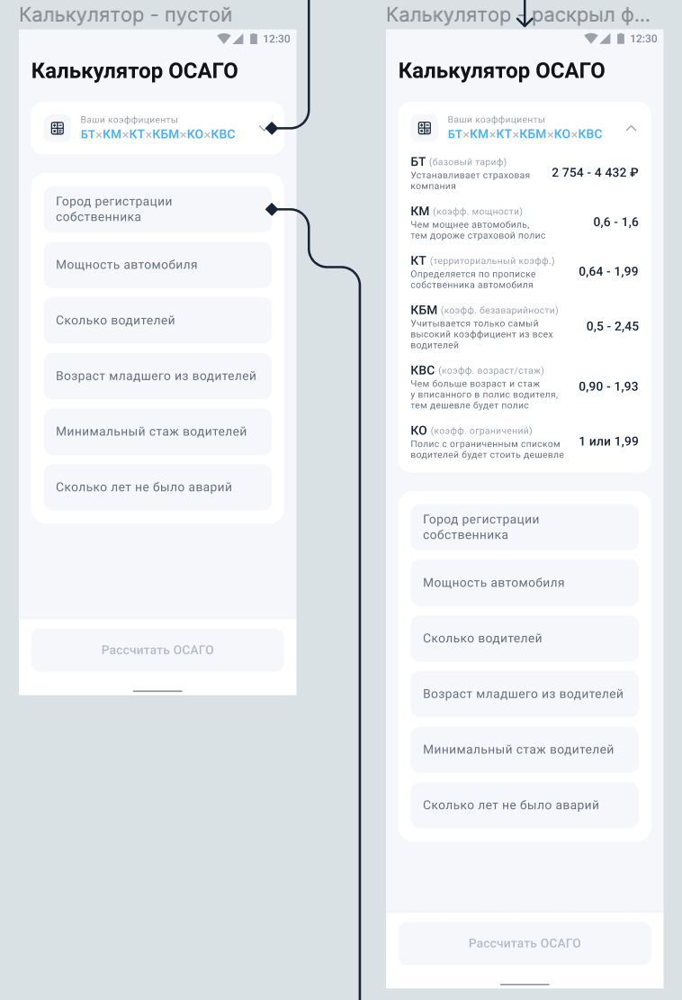

## Задание: Часть 1 (1 неделя)

* дизайн и иконки использовать из макетов figma;
* секция с коэффициентами разворачивается;
* первоначальная информация статичная
* тап по полю ввода ведет на шторку ввода коэф-та;
* когда все коэф-ты определены, разблокируется кнопка “Рассчитать ОСАГО” и нажатие на нее ведет на список страховых