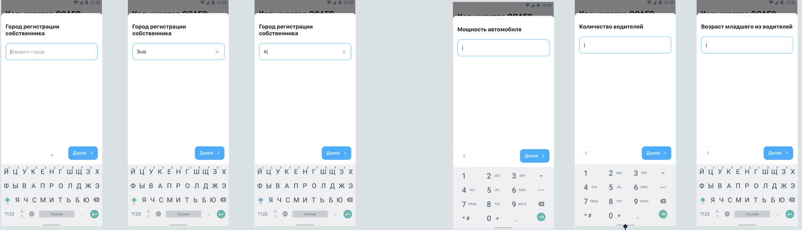
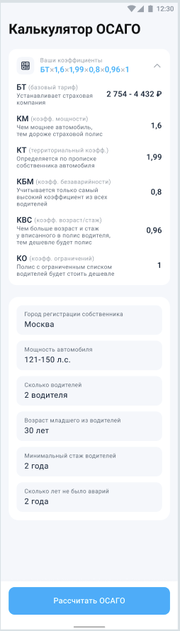

## Задание: Часть 2 (одна неделя)

По нажатию на ввод коэффициента открывается шторка, заголовки идут с предыдущего экрана. Значение коэф-та определяется из ответа http://mock.sravni-team.ru/mobile/internship/v1/osago/rationDetail POST-запроса при закрытии шторки на основе все введенных до этого коэф-в. Нажатие на кнопку “далее” меняет содержимое на значения для ввода следующего параметра. На последней шторке вместо “Далее” кнопка “Подтвердить”

После выбора значения параметра и появлении ответа с сервера со значением коэффициента меняется:
* Значение коэффициента в разворачивающейся ячейке
** Заголовок (вставляется цифра вместо сокращения коэффициента)
** Разворот (подробное описание)
* Коэффициент в поле ввода
