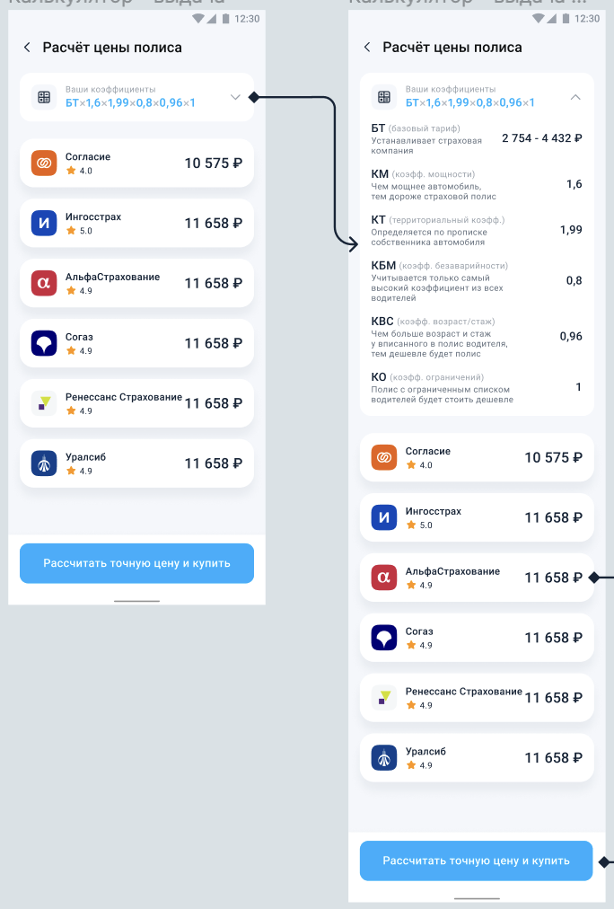

## Задание: Часть 3 (одна неделя)

При нажатии на “рассчитать ОСАГО” открывается экран

Данные коэф-тов прокидываются с предыдущего экрана. Первая секция разворачивается. Текст статичный, коэф-ты с предыдущего экрана 

Формируем список страховых на основе ответа http://mock.sravni-team.ru/mobile/internship/v1/osago/startCalculation POST-запроса (в запрос уходят все значения коэф-в), в котором придет:
* Наименование страховой;
* Ссылка на логотип .svg;
* Рейтинг;
* Итоговая цена;
Кнопка внизу - пустышка. 

---

### На время загрузки страховых рисуем скелет 

